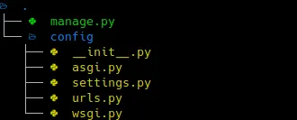

I open the terminal, create a new directory in the `Projects` folder. And now what?

Every time I start a new Python project I go through the painful process of looking how the hell I setup the last one. So, no more. This is the definitive guide of how to create from scratch a new Django project… in 2020.

Of course, you could use [Cookiecutter](https://github.com/cookiecutter/cookiecutter) for this. I like it, really. But unless you are super familiarized with the template you’re using, you’ll feel that you’re losing the control… And if this happens at the start of the project it can’t end well. So better to understand the foundations of what you have in your hands.

In this post I’ll guide you only in the very basic project setup for Django, through it would be more or less the same if you use other, or no framework. And I’ll end the process just right before writing the first line of code. Though I’ll write another one about, how to setup linting & testing, how I implement the *Clean Architecture* in a Django project, deployment, CI/CD, and so on, if you ask for it.

## Python version

We are in 2020, aren’t we? So let’s use Python 3.8. First recommendation: use [pyenv](https://github.com/pyenv/pyenv). This will allow to have installed in your system any Python version you need, and switch to a specific version according to the shell session or directory you are. Very handy.

The [installation](https://github.com/pyenv/pyenv#installation) is easy. And once you have pyenv installed, you can install the version of Python you need:

```
$ pyenv install 3.8.2
```

Then, you can active that version in the current session shell:

```
$ pyenv shell 3.8.2
$ python --version
Python 3.8.2
```

Beautiful.

## Create a Django project

Choosing a fancy name for you brand new project will be the hardest part of all this process. To make things easier for you to follow this article I’m going to set an environment variable, so set any name you want:

```
$ export PROJECT_NAME=the_project
```

Not pretty creative, I know.

Remember we activated a Python version with pyenv. That’s mean we are in a new virtual environment. So we can install things in it. For instance, let’s install Django:

```
$ pip install --user Django
```

Then we can use `django-admin` to generate the basic project structure:

```
$ django-admin startproject $PROJECT_NAME
```

The next part is something I like to do, but it’s not the conventional way of structuring projects in Django, so maybe you want to skip this part:

```
$ cd $PROJECT_NAME
$ mv $PROJECT_NAME/ config
$ find . -type f -name '*.py' -exec sed -i "s/$PROJECT_NAME/config/g" '{}' \;
```

What this does is to rename the directory that django-admin creates inside your project, that has the same name of the root directory. So we go from this:


To this:



Of course, it’s not only the name of a directory, but also we have change the references in the code itself.

Again: this is only a cosmetic change that goes against the standard way of structuring a Django project. You don’t need to do that, but it makes sense to me.

Anyway, you can run the server right now to check everything is ok so far:

```
$ python manage.py runserver
```

## Version control

This is trivial. Let’s suppose you’re still in the project root directory:

```
$ git init
```

The next one is also basic, the `.gitignore` file, but I used to lost a lot of time writing it by hand. No more:

```
$ curl https://raw.githubusercontent.com/github/gitignore/master/Python.gitignore --output .gitignore
```

This will cover all the needs of a Python project.

Finally:

```
$ git add .
$ git commit -m "First commit"
```

## Python environment for the project

Remember we set the Python version for the current shell session, but it would be a good idea to set up it for the project. We can do that like this:

```
$ pyenv local 3.8.2
```

This will create a file called .python-version that pyenv will use to establish the version to use when you run python. This is useful for you, but also the rest of the team won’t need to guess the version they need to use.

```
$ git add .
$ git commit -m "Set Python version for the project"
```

## Beautiful dependency and packaging management

Say goodbye to the old way of packaging a Python project with setup.py and freezing dependencies in a requirements.txt. And say hello to [Poetry](https://python-poetry.org/). This tool comes with all you need to handle dependencies you need —also for development — ; build packages — tar.gz, wheels — ; and also publishing — to PyPI, for example — .

Install it for your system, and then run in the root of your project:

```
$ poetry init -n
```

This will create a file called pyproject.toml, that is the new [standard](https://www.python.org/dev/peps/pep-0518/) way to configure the build requirements.

For instance, let’s add the only one dependency we have at the moment:

```
$ poetry add Django
```

And done! This won’t only install the package, but it will add it to the configuration file of your project. pip freeze no more. And if you are curious where poetry store the virtual environment for this project, run poetry env info.

Now, to run your code, you only need to do:

```
$ poetry run python manage.py runserver
```

Don’t forget to commit:

```
$ git add .
$ git commit -m "Add poetry"
```

## Don’t mess with the repo

The final touch of this setup is to add [pre-commit](https://pre-commit.com/) to the mix. This is a mechanism to configure a list of checks that will run any time you make a git commit.

```
$ poetry add -D pre-commit
$ poetry run pre-commit install
```

Easy peasy. The first command will add the package pre-commit to the **development** dependencies (note the -D parameter). The second one will install the hook in your local git repo. That’s something you need to do any time you clone the repo in a new machine, so don’t forget to add to your README.

Now you need to configure it. Also very simple:

```
$ poetry run pre-commit sample-config > .pre-commit-config.yaml
```

This will give you a basic configuration. But let’s add something very useful:

```
cat >> .pre-commit-config.yaml << EOF
- repo: https://github.com/psf/black
  rev: stable
  hooks:
    - id: black
      language_version: python3.6
EOF
```

[Black](https://github.com/psf/black) is a code formatter that should be mandatory for every Python project. There are plugins for plenty of editors and IDEs, so you should install it, so that it will reformat the code any time you save the file. Forget about thinking if you need to use single or double quotes, length of lines, and so. Write Python code as ugly as you can and Black will take over.

Let’s test it:

```
$ poetry run pre-commit run --all-files
```

If there is any error that could mean that Black had to format some files. Run again and check again. It should end clean.

```
$ git add .
$ git commit -m "Add pre-commit"
```

## That’s all!

And we are done. It’s seem like a lot of things to do, but all of this can be put in a Bash file that will take only a few seconds to run it all:

<script src="https://gist.github.com/cristobalcl/97f1274f0533acff15bc8d6a9d195448.js"></script>

You can see the final [project in GitHub](https://github.com/cristobalcl/the_project/tree/part_1).

# Wrapping up

From here, there is a lot of things to do:

* Add linter, type checking, testing,…
* Set up the skeleton of a Clean Architecture for Django.
* CI to run tests and publish the artifacts (to PyPI, for example), deployment,...
* Documentation generation.

And I surely will write about all of this in the future. So, if you want to see more articles like this, follow me on Twitter, and let me know:

💡 You can read now the second part of the series [Set up tests, linters and type checking in Python projects in 2020](https://medium.com/@cristobalcl/set-up-tests-linters-and-type-checking-in-python-projects-in-2020-9cc1b1e2750d)!
