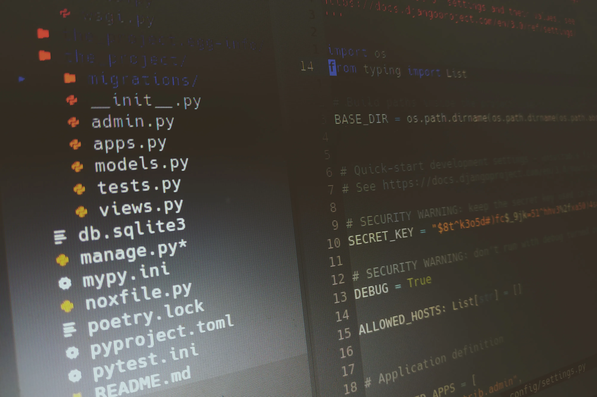

*This is the second part of the article [How to start a Python project with Django in 2020](/blog/python-django-2020).*

Now you have a beautiful virgin Django project skeleton, and you are ready to start writing tests, model your business domain, implement uses cases,… But wait! Wouldn’t it be great to have a system to perform a lot of checks automatically so we can not be able to send garbage to the remote repository?

That’s what we are going to setup today:

* A system to run our test suite, and get a report with the results.
* Code style checking, to make sure that the code of the team respects some standards.
* Type checking to help us discover some tricky bugs and mistakes in our code.

## Before starting

Remember that we already have [some work done](/blog/python-django-2020). In any case, you can clone the branch `part_1` of our project and go from that. Find it here. You can do that simply by running:

```
git clone https://github.com/cristobalcl/the_project.git
cd the_project
git fetch
git checkout part_1
```

Until now, our only external dependencies are:

* [pyenv](https://github.com/pyenv/pyenv#installation)
* [Poetry](https://python-poetry.org/docs/#installation)

And don’t forget to install the `pre-commit` hook:

```
poetry run pre-commit install
```

At the end of the previous article we ended with an empty Django project. Let’s add an application to it:

```
export PROJECT_NAME=the_projectpoetry run python manage.py startapp $PROJECT_NAME
```

Remember that, in Django, an application is a module inside the project. This is how our project tree looks like now:


We’ll remove some files and add others in the future, but let’s leave it like that for the moment.

## Testing

We are going to use [pytest](https://docs.pytest.org/en/latest/) framework. It’s very minimalistic at the beginning, but can grow to be as complex as you need. To install it:

```
poetry add -D pytest
```

And to run the suite:

```
poetry run pytest
```

Of course, the command ends with an error: no tests to run. Let’s add a minimal one:

```
cat > the_project/tests.py << EOF
def test_minimal():
    assert True
EOF
```

But if you run again `poetry run pytest`… Surprise! Same error again: no tests! The problem is that pytest is looking for tests in files with the name test_*.py. And the default filename for tests in Django is simply `tests.py`. No problem, let’s add a simple configuration:

```
cat > pytest.ini << EOF
[pytest]
python_files = tests.py test_*.py
EOF
```

Run pytest again and…

```
$ poetry run pytest
====================== test session starts ======================
platform linux -- Python 3.8.2, pytest-5.4.2, py-1.8.1, pluggy-0.13.1
rootdir: ./the_project, inifile: pytest.ini
collected 1 itemthe_project/tests.py .                                    [100%]
======================= 1 passed in 0.21s =======================
```

Bingo!

## Code coverage

Much more important than the number of tests you have, is how much code have you covered with tests. Code coverage will give you a measurement of how good are you applying TDD.

For this, we’ll use [coverage](https://coverage.readthedocs.io/). And we are going to install it with an extra, `toml`, so we can put its configuration in the `pyproject.toml` file:

```
poetry add -D coverage[toml]
```

Let’s add the configuration:

```
cat >> pyproject.toml << EOF[tool.coverage.run]
omit = [".*", "*/site-packages/*"][tool.coverage.report]
fail_under = 100
EOF
```

This does two things: 1) it will ignore the source files that don’t belong to our project, and 2) it will establish a threshold of 100% of code coverage. That’s mean that it will throw an error if we don’t tests every line of code of the source files we are testing.

Now we can run the tests with coverage and see the results:

```
$ poetry run coverage run -m pytest && poetry run coverage report -m
=================== test session starts ===================
platform linux -- Python 3.8.2, pytest-5.4.2, py-1.8.1, pluggy-0.13.1
rootdir: ./the_project, inifile: pytest.ini
collected 1 itemthe_project/tests.py .                                        [100%]==================== 1 passed in 0.29s ====================
Name                      Stmts   Miss  Cover   Missing
-------------------------------------------------------
the_project/__init__.py       0      0   100%
the_project/tests.py          3      0   100%
-------------------------------------------------------
TOTAL                         3      0   100%
```

Beautiful. Remember that we have a 100% of coverage because our tests doesn’t call any other source file.

Maybe you’re thinking that a 100% of code coverage is too much, or unrealistic. I recommend that you stay with that, and if you really need to keep some lines out of testing, use [coverage’s mechanism to exclude code](https://coverage.readthedocs.io/en/coverage-5.1/excluding.html). Remember the [Zen of Python](https://www.python.org/dev/peps/pep-0020/):

*Explicit is better than implicit.*

## Linting

We already have **Black** in place to beautify our code. That’s not enough to conforms to [PEP8](https://www.python.org/dev/peps/pep-0008/). So, to make sure we do, we’ll use [flake8](https://flake8.pycqa.org/en/latest/). But also we’ll install [Bugbear](https://github.com/PyCQA/flake8-bugbear), a plugin that contains some useful warnings:

```
poetry add -D flake8 flake8-bugbear
```

We need to add some configuration in order to omit some files. Also, we’ll ignore the PEP8 limit of longitude of lines, and we’ll stick to Black’s recommendation of using Bugbear’s B950 warning: it will be triggered when there are too much lines longer than 80 characters.

```
cat > .flake8 << EOF
[flake8]
max-line-length = 88
max-complexity = 10
select = C,E,F,W,B,B950
ignore = E203,E501,W503
exclude =
    .git,
    __pycache__,
    *.egg-info,
    .nox,
    .pytest_cache,
    .mypy_cache
EOF
```

Notice that we are also ignoring a lot of directories that would make flake8 to take an eternity to run.

Having done that, we can run it:

```
$ poetry run flake8
./config/settings.py:91:78: E231 missing whitespace after ','
./config/settings.py:92:79: E231 missing whitespace after ','
./config/settings.py:93:80: E231 missing whitespace after ','
./the_project/views.py:1:1: F401 'django.shortcuts.render' imported but unused
./the_project/admin.py:1:1: F401 'django.contrib.admin' imported but unused
./the_project/models.py:1:1: F401 'django.db.models' imported but unused
./the_project/apps.py:5:12: BLK100 Black would make changes.
```

Ups! Lot’s of warnings. But don’t worry, all of then can be solved easily. The E231 warning it’s due a little [Black’s bug](https://github.com/psf/black/issues/1289). We can fix it simply removing the needless comma:

```
sed -i 's/",}/"}/g' config/settings.py
```

To fix F401 warnings we only need to remove the unused imports of the Django generated code. In fact, we are going to totally empty those files:

**IMPORTANT:** notice that > is the instruction here to clean the files. Yep, it works just like that in Bash.

```
> the_project/views.py
> the_project/admin.py
> the_project/models.py
```

And finally, BLK100 warning simply tell us that we should run black on the file:

```
poetry run black the_project/apps.py
```

And if you run flake8 again it will end clean finally.

```
poetry run flake8
```

## Type checking

We are going to make plenty use of the type annotations of Python in the future. But the weird thing is that they are not checked in runtime. So we need a tool to do those checks statically in our code. We are going to use [mypy](http://mypy-lang.org/) for this:

```
poetry add -D mypy
```

If we run it, we’ll get a lot of errors related with modules that don’t have type hints. So, let’s add some configuration to ignore those imports:

```
cat > mypy.ini << EOF
[mypy][mypy-nox.*,django.*]
ignore_missing_imports = True[mypy-the_project.migrations.*]
ignore_errors = True
EOF
```

As you can see, we also disabled the warnings for the module **nox**, that we’ll use later. In the future Django migrations will be a problem too, so we’ll ignore those files as well. If you add more modules or new imports in your project remember to add them here.

Let’s run it now:

```
$ poetry run mypy .
config/settings.py:28: error: Need type annotation for 'ALLOWED_HOSTS' (hint: "ALLOWED_HOSTS: List[<type>] = ...")
Found 1 error in 1 file (checked 13 source files)
```

Only an error! Not bad. And it’s an easy one to fix.

A normal article will tell you to open the darn editor, make such and such change, save and quit. But where would the fun in that? Let’s use the terminal once more time!

```
patch config/settings.py << EOF
13a14
> from typing import List
28c29
< ALLOWED_HOSTS = []
---
> ALLOWED_HOSTS: List[str] = []
EOF
```

Delightful.

This will make mypy pass without errors.

```
poetry run mypy .
```

## A command to rule them all

We have added a lot of tools and checks in our project. And it will be annoying to run them one by one each time. That’s why I’m going to introduce a tool to automate all those checks.

The most used tool of this kind is [tox](https://tox.readthedocs.io/). Very powerful, but I never really liked it. The configuration is a little dirty to my taste. And I find difficult to add or change things. So, when I discovered [nox](https://nox.thea.codes/) I fell in love: in nox, the configuration is a Python file 🤯

Firstly, let’s install nox in our Python environment (and Black in the Poetry env, so we could run it in the linter section):

```
pip install nox
poetry add -D black
```

Now, let’s create the configuration file, a Python script, indeed:

```
cat > noxfile.py << EOF
import nox@nox.session(python=["3.7", "3.8"])

def tests(session):
    session.install("poetry")
    session.run("poetry", "install")
    session.run("coverage", "run", "-m", "pytest")
    session.run("coverage", "report")@nox.session

def lint(session):
    session.install("poetry")
    session.run("poetry", "install")
    session.run("black", "--check", ".")
    session.run("flake8", ".")@nox.session

def typing(session):
    session.install("poetry")
    session.run("poetry", "install")
    session.run("mypy", ".")
EOF
```

The first thing you should notice is that the tests will run for two Python versions: 3.7 and 3.8. But in our project we defined 3.8 as the minimal version, we need to fix that:

```
patch pyproject.toml << EOF
8c8
< python = "^3.8"
---
> python = "^3.7"
EOF
```

The other thing you can find interesting is that we first install Poetry in the nox session, and then use Poetry to install the project dependencies.

Finally you can run nox simply calling it:

```
nox
```

This will create its own virtual environments with the Python versions we specified, and run all the check that we defined. And it will take a while to finish… But next times, you can reuse the previously created environments like this:

```
nox -r
```

This wonderful tool, nox, will be very useful when we setup our *Continuous Integration* pipeline.

## Update the pre-commit

We added lots of tests and checks. It would be great to run them in our pre-commit. Easy:

```
cat >> .pre-commit-config.yaml << EOF
- repo: https://gitlab.com/pycqa/flake8
  rev: 3.8.1
  hooks:
  - id: flake8
    additional_dependencies: [flake8-bugbear]
- repo: local
  hooks:
  - id: tests
    name: tests
    entry: poetry run pytest
    language: system
    types: [python]
    pass_filenames: false
- repo: https://github.com/pre-commit/mirrors-mypy
  rev: 'v0.770'
  hooks:
  - id: mypy
EOF
```

As you can see, for the tests we use a *local* hook instead of setting a remote repository. You could use something similar to run your own scripts.

Let’s test the new configuration:

```
poetry run pre-commit run --all-files
```

It will run smoothly.

## Recipe

Just like I did in the previous article, I’ll provide the complete Bash script to replicate what we did in this article:

<script src="https://gist.github.com/cristobalcl/564d361f828f0b7a32f4fc5a29b6b4bc.js"></script>

Also, you can clone the [final results in GitHub](https://github.com/cristobalcl/the_project/tree/part_2).

## Wrapping up

Let’s recap what we’ve done in this article:

* Create a Django module (application) with a minimal test
* Setup pytest to run our test suite
* Setup coverage for tests report
* Use flake8 for code linting
* Configure mypy for type checking
* Create a nox script to run all the tests and checks we’ve configured
* Update pre-commit with some of this checks

As I stated in the first article, there is easier ways to setup all of this. You could simply use a [Cookiecutter](https://cookiecutter.readthedocs.io/) template to create a project with lots of features built in it. But the goal of this series is that you understand all the different parts, and know how and where to touch to change anything you need.

In next articles I’ll talk about *Clean Architecture* in Django, *Continuous Integration*, deployment, and much more. [Follow me on Twitter](https://twitter.com/cristobal_dev) to get the latest updates on this series.
